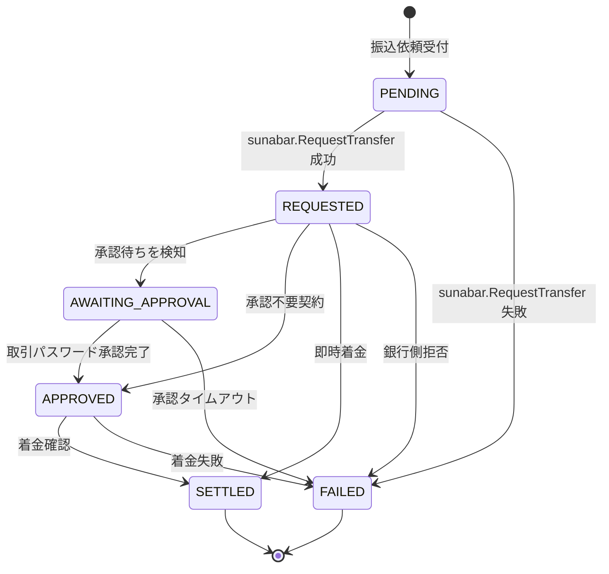

> 本章ドラフトの正本は `/Users/yujiokamoto/devs/zenn/articles/go-sunabar-outbox-chapter-03-draft.md` に置いています。
> リポジトリ側の本ファイルはADRや設計議論との紐付けのために置いた控えで、内容は同期しています。
> 編集はZenn側を正本として、控えに反映する運用にします。

---

# 3. Outboxの肝 — 冪等性とメールトークン承認の状態遷移

海外のOutbox記事はだいたい「決済成功からイベント発行を経て通知に至る」という流れを前提にしています。Stripeが手元にある世界の話です。一方で国内のsunabar APIで個人がGMOあおぞらネット銀行に振込を投げる場合、依頼は2段階で進みます。振込依頼APIが返してくるのは「銀行が受け付けた」までで、その先にメールトークン承認と結果確定という2つのフェーズが残ります。本章ではこの「2段階性」をモジュラーモノリスにOutboxパターンで載せる際の設計判断のうち、最もsunabar特有な3点だけを取り上げます。結論を先に書くと、状態機械にAWAITING_APPROVALを明示し、冪等キーをアプリ層とAPI層で二重に持ち、結果照会はOutboxの再投入メカニズムに乗せる、という3点です。

## 3-1. sunabarの振込が「2段階」である事実

sunabarで振込依頼APIを叩くと、サーバはapplyNoとメールトークン承認URLを返します。そこで処理は止まります。利用者がブラウザでサービスサイトのお知らせを開き、取引パスワードを入力して承認するまで、銀行は実際の送金処理を進めません。承認が通った後にようやく結果照会APIで「Settled」か「Failed」が見えます。本番BaaSでは事業者契約形態によりこの承認方式が変わりますが、「依頼から承認を経て確定に至る」という3ステップの構造は残ります。だから「決済から通知へ」という2状態モデルでは表現しきれません。海外のOutbox実装記事をそのままコピーすると、ここで詰まります。

## 3-2. 状態機械にAWAITING_APPROVALを置く設計判断

状態としてAWAITING_APPROVALを持つかどうかは、設計の選択点でした。「持たずにREQUESTEDからSETTLEDに直接遷移させる」という案も検討しました。状態数は減りますし、終端までの線も短くなります。ただしこの案を採ると、メールトークン承認待ちというフックポイントを失います。Notificationモジュールから「ユーザに承認URLを案内する」契機が取りにくくなりますし、滞留時間メトリクスも撒けません。承認が長引いている案件を運用上ピックアップしたいなら、状態として明示しておく方が後段が楽になります。

そこで採ったのは「持つ。ただしvalidTransitionsに複数経路を許す」という方針です。本番BaaSでメール承認が不要な契約に切り替わったとき、REQUESTEDからAPPROVEDへ直行する経路や、即時着金でREQUESTEDからSETTLEDに飛ぶ経路にも対応できる構造にしています。AWAITING_APPROVALを必ず通る一本道にしてしまうと、契約形態の変化で状態機械を作り直す羽目になります。詳細はADR-004にまとめてあります。



下記スニペットはvalidTransitionsマップの抜粋です。REQUESTEDから複数経路を許す形を、コードでそのまま読めます。

```go
var validTransitions = map[Status][]Status{
    StatusPending:          {StatusRequested, StatusFailed},
    StatusRequested:        {StatusAwaitingApproval, StatusApproved, StatusSettled, StatusFailed},
    StatusAwaitingApproval: {StatusApproved, StatusSettled, StatusFailed},
    StatusApproved:         {StatusSettled, StatusFailed},
    StatusSettled:          {},
    StatusFailed:           {},
}
```

ここから読み取れるのは、状態数を増やしてでも「契約形態の差」を内側で吸収する余白を残したという意思です。状態が増えるぶんテストケースは増えますが、状態機械の単体テストはAAAパターンで書けて見通しがよく、トレードオフとしては許容範囲に収まります。

GitHub: `internal/modules/transfer/domain/status.go`

## 3-3. 冪等キーをアプリ層とAPI層で二重持ちする

冪等キーをどこで持つかという点でも迷いました。クライアントが生成したキーをそのままsunabarに流すのが最短ですが、クライアントの実装ミスで毎回違うキーになると、ネットワーク再送がそのまま二重振込になります。逆にサーバ生成キーだけを使うと、クライアントから「同じ依頼か違う依頼か」を識別する手段がなくなり、ネットワーク失敗時の再送で別Transferが作られてしまいます。

そこで採ったのが二重持ちです。app_request_idをクライアント生成、api_idempotency_keyをサーバがTransfer作成時に1度だけ生成して永続化し、再送時は同じ値を再利用します。transfersテーブルの該当部分は次のようになります。

```sql
app_request_id      VARCHAR(64) NOT NULL,
api_idempotency_key CHAR(36)    NOT NULL,
...
UNIQUE KEY uq_app_request_id (app_request_id),
UNIQUE KEY uq_api_idempotency_key (api_idempotency_key),
```

UNIQUE制約を2列に張ることで、HTTP API受付時の重複検知と、sunabarへの送信時の冪等性確保を、データ層だけで担保できます。アプリケーション層では「INSERTで重複が出たらErrAlreadyExistsとして既存を返す」という単純な分岐だけ書けばよくなります。冪等性のロジックをif文ベタ書きで管理すると必ずどこかで漏れますから、UNIQUE制約に押し付けてしまうのが堅い設計です。

> 冪等キーTTLで詰まりかけた話
>
> sunabarや本番BaaSの冪等キーには有効期限があります。期限切れ時に「自動でキーを再生成して再送する」処理を入れると、銀行側で別取引扱いになり二重振込のリスクがあります。仕様書を読み直して気づいたのですが、安全側に倒すなら期限切れの自動再生成はしません。検知時はエラーで止め、運用判断で個別対応にします。これはADR-003で明示しています。

## 3-4. リレーの再投入で「結果照会」を駆動する

結果照会のために専用のポーリングワーカーを書きたくなりました。1分おきにtransfersテーブルをSELECTし、未確定のものをsunabarへ照会しに行く、というありがちな構成です。ただしOutboxのリレー機構をそのまま流用できることに気付きました。

具体的にはTransferStatusCheckScheduledというOutboxイベントを発行しておき、ハンドラが結果未確定の場合はErrStillInFlightを返します。Relay側はこれをエラーとして受け取って次回時刻を未来に更新するので、指数バックオフで再投入されます。確定であるSETTLEDかFAILEDになったらハンドラはnilを返し、RelayがSENTに遷移させて打ち切ります。専用プロセスを増やさずに「定期照会」を実現できる構造です。プロセス図がシンプルになり、運用上も「Relayさえ動いていれば結果照会も回る」という保証が得られます。

```go
if t.Status == to {
    if to.IsTerminal() {
        return nil
    }
    return ErrStillInFlight
}
return h.applyStatus(ctx, t, to, res.StatusDetail, p.ApplyNo)
```

ここから読み取れるのは「終端ならnilを返し、未確定ならErrStillInFlightを返し、状態が変わるならapplyStatusで更新してから判定する」という3分岐です。再投入の仕組みはOutbox標準のメカニズムに乗せています。「結果照会専用のプロセスを増やすべきか」という議論は、この実装で要らなくなりました。

GitHub: `internal/modules/transfer/application/handler_check_status.go`

---

GitHubリポジトリ: `https://github.com/<owner>/go-sunabar-payments`
関連ADR: ADR-003 (冪等キーの二重持ち) / ADR-004 (AWAITING_APPROVALを持つ) / ADR-005 (受信側冪等性)
