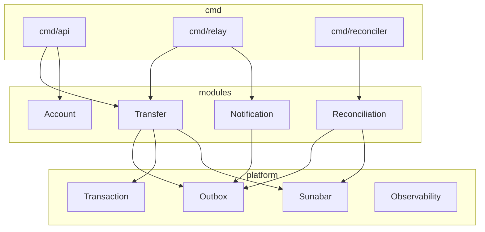
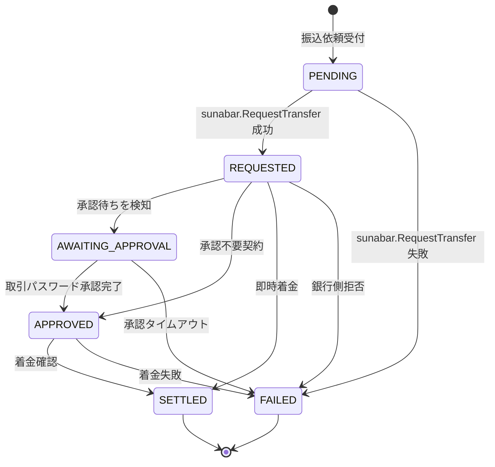
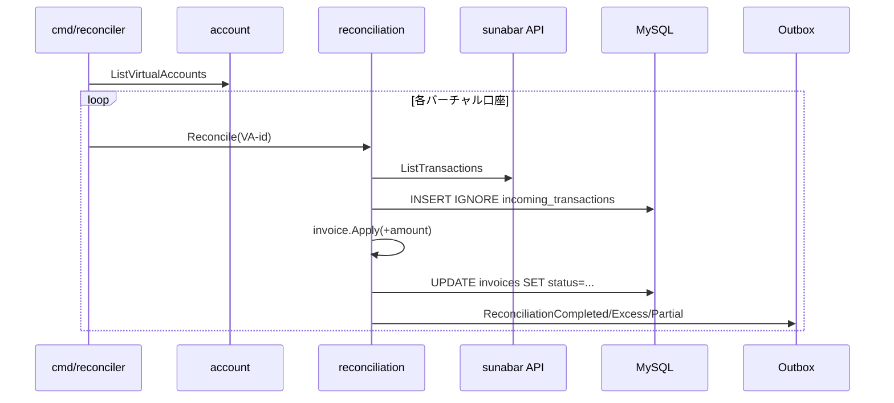

> 実装コードはGitHubで公開しています ( 日本語コメント付き ) 。
> リポジトリ: `https://github.com/<owner>/go-sunabar-payments`

## はじめに

国内で個人がお金を動かせる銀行APIは、選択肢が極端に少ないです。Seven BankやMUFGの個人向けAPIは参照系だけで、実際の振込は事業者契約が要ります。一方でGMOあおぞらネット銀行のsunabarは、口座開設すれば審査なしで20種類以上のAPIを叩け、振込・入出金照会・バーチャル口座まで動きます。2023年には冪等キーが導入され、メールトークン承認も整備されたので、個人開発でFintechの「動くもの」を作る現実的な土台になりました。

ところが既存のsunabar記事は「Pythonで動かしてみた」「Node.jsで叩いてみた」が中心で、本番移行を見据えた設計の話はあまり出てきません。本記事はそこを埋めるために、Goでクリーンアーキテクチャ風レイヤー分離とモジュラーモノリス×Outboxを採用し、本番BaaSへの差分を構造で吸収する設計を扱います。実装は最小ですが、設計判断はすべてADRとしてリポジトリに残してあります。

本記事の前提知識はGoの基礎 ( structとinterface、goroutine、database/sql ) 、DDDの軽い知識 ( 集約、値オブジェクト ) 、SQLトランザクションと楽観ロックの基本です。Stripe文脈で決済設計を経験している読者には、国内案件で詰まりやすい論点が並びに見えるはずです。

## 1. なぜGoとsunabarで個人開発から始めるべきか

sunabarが個人開発の入口として優れている理由は3つあります。第一に、口座を開けば追加審査なしで利用できる点です。Stripe Connectや本番BaaS契約と違って、ビジネス実体や法人格を問われません。第二に、APIの成熟度です。OAuth2.0/OIDC対応、冪等キー必須、メールトークン承認、入出金明細とバーチャル口座まで揃っており、本番BaaSの仕様にかなり寄せられています。第三に、本番BaaSへの移行が現実的に見える点です。エンドポイントとペイロード形が大きく変わるわけではないので、認可フローと一部の業務ルールを差し替えれば乗り換えられます。

GoはこのレイヤーでHaskellやRustほど学習コストを払いたくない場合に向いています。標準ライブラリだけで HTTPサーバとDBアクセスとロギングがきれいに揃い、状態遷移や冪等性のロジックは型と小さなinterfaceで素直に表現できます。本記事のリポジトリでは、ルーターも標準のnet/httpで書き、サードパーティ依存はMySQLドライバとtestcontainersとUUIDライブラリだけに絞っています。設計判断の解像度を落とさずに、実装はあくまでミニマルに保つ方針です。

書く順序として、いきなり振込APIから始めるのは避けています。まず口座一覧とバーチャル口座を試して感覚を掴み、その上で振込の状態遷移と冪等性の話に入ります。お金が動く処理は最後の最後で書く方が事故が起きにくいです。

## 2. ドメインをどうモジュールに切るか

設計の最初の分岐点は、銀行APIをどの粒度でラップするかです。素直にやろうとすると「銀行API呼び出し」を1つのpackageにまとめたくなりますが、これは罠でした。バーチャル口座と振込と消込が同じpackageに同居すると、消込の機能追加で全packageに影響が出ます。状態遷移の責務もpackage越しに散ります。

採ったのは4モジュール構成です。Account ( 口座参照とバーチャル口座発行 ) 、Transfer ( 振込依頼と状態管理 ) 、Reconciliation ( 入金消込 ) 、Notification ( イベント駆動の通知 ) の4つに分け、各モジュールはport.goに定義したinterfaceでのみ他モジュールから参照されます。横断的関心事 ( Outbox、Unit of Work、sunabarクライアント、観測性 ) は`internal/platform/`に集約し、モジュールはplatformに対してinterface経由で依存します。



公開APIはport.goの単位で書くので、見た目は次のような薄いinterfaceに集約されます。

```go
package transfer

type Service interface {
    RequestTransfer(ctx context.Context, cmd application.RequestTransferCommand) (*domain.Transfer, error)
    GetTransfer(ctx context.Context, id string) (*domain.Transfer, error)
}
```

なぜ4つかというと、外部APIの粒度ではなく自分のドメインで意思決定が独立する単位で切ったからです。sunabar側に通知方式が増えても、TransferやReconciliationは影響を受けません。Notificationが受信側冪等性を持っているので、新しいイベントタイプを足すときも単独で完結します。詳細はADR-001にあります。

## 3. Outboxの肝 — 冪等性とメールトークン承認の状態遷移

海外のOutbox記事はだいたい「決済成功からイベント発行を経て通知に至る」という流れを前提にしています。Stripeが手元にある世界の話です。一方で国内のsunabar APIで個人がGMOあおぞらネット銀行に振込を投げる場合、依頼は2段階で進みます。振込依頼APIが返してくるのは「銀行が受け付けた」までで、その先にメールトークン承認と結果確定という2つのフェーズが残ります。本章ではこの「2段階性」をモジュラーモノリスにOutboxパターンで載せる際の設計判断のうち、最もsunabar特有な3点を取り上げます。結論を先に書くと、状態機械にAWAITING_APPROVALを明示し、冪等キーをアプリ層とAPI層で二重に持ち、結果照会はOutboxの再投入メカニズムに乗せる、という3点です。

### 3-1. sunabarの振込が「2段階」である事実

sunabarで振込依頼APIを叩くと、サーバはapplyNoとメールトークン承認URLを返します。そこで処理は止まります。利用者がブラウザでサービスサイトのお知らせを開き、取引パスワードを入力して承認するまで、銀行は実際の送金処理を進めません。承認が通った後にようやく結果照会APIで「Settled」か「Failed」が見えます。本番BaaSでは事業者契約形態によりこの承認方式が変わりますが、「依頼から承認を経て確定に至る」という3ステップの構造は残ります。だから「決済から通知へ」という2状態モデルでは表現しきれません。海外のOutbox実装記事をそのままコピーすると、ここで詰まります。

### 3-2. 状態機械にAWAITING_APPROVALを置く設計判断

状態としてAWAITING_APPROVALを持つかどうかは、設計の選択点でした。「持たずにREQUESTEDからSETTLEDに直接遷移させる」という案も検討しました。状態数は減りますし、終端までの線も短くなります。ただしこの案を採ると、メールトークン承認待ちというフックポイントを失います。Notificationモジュールから「ユーザに承認URLを案内する」契機が取りにくくなりますし、滞留時間メトリクスも撒けません。承認が長引いている案件を運用上ピックアップしたいなら、状態として明示しておく方が後段が楽になります。

そこで採ったのは「持つ。ただしvalidTransitionsに複数経路を許す」という方針です。本番BaaSでメール承認が不要な契約に切り替わったとき、REQUESTEDからAPPROVEDへ直行する経路や、即時着金でREQUESTEDからSETTLEDに飛ぶ経路にも対応できる構造にしています。AWAITING_APPROVALを必ず通る一本道にしてしまうと、契約形態の変化で状態機械を作り直す羽目になります。詳細はADR-004にまとめてあります。



下記スニペットはvalidTransitionsマップの抜粋です。REQUESTEDから複数経路を許す形を、コードからそのまま読み取れます。

```go
var validTransitions = map[Status][]Status{
    StatusPending:          {StatusRequested, StatusFailed},
    StatusRequested:        {StatusAwaitingApproval, StatusApproved, StatusSettled, StatusFailed},
    StatusAwaitingApproval: {StatusApproved, StatusSettled, StatusFailed},
    StatusApproved:         {StatusSettled, StatusFailed},
    StatusSettled:          {},
    StatusFailed:           {},
}
```

ここから読み取れるのは、状態数を増やしてでも「契約形態の差」を内側で吸収する余白を残したという意思です。状態が増えるぶんテストケースは増えますが、状態機械の単体テストはAAAパターンで書けて見通しがよく、トレードオフとしては許容範囲に収まります。

GitHub: `internal/modules/transfer/domain/status.go`

### 3-3. 冪等キーをアプリ層とAPI層で二重持ちする

冪等キーをどこで持つかという点でも迷いました。クライアントが生成したキーをそのままsunabarに流すのが最短ですが、クライアントの実装ミスで毎回違うキーになると、ネットワーク再送がそのまま二重振込になります。逆にサーバ生成キーだけを使うと、クライアントから「同じ依頼か違う依頼か」を識別する手段がなくなり、ネットワーク失敗時の再送で別Transferが作られてしまいます。

そこで採ったのが二重持ちです。app_request_idをクライアント生成、api_idempotency_keyをサーバがTransfer作成時に1度だけ生成して永続化し、再送時は同じ値を再利用します。transfersテーブルの該当部分は次のようになります。

```sql
app_request_id      VARCHAR(64) NOT NULL,
api_idempotency_key CHAR(36)    NOT NULL,
...
UNIQUE KEY uq_app_request_id (app_request_id),
UNIQUE KEY uq_api_idempotency_key (api_idempotency_key),
```

UNIQUE制約を2列に張ることで、HTTP API受付時の重複検知と、sunabarへの送信時の冪等性確保を、データ層だけで担保できます。アプリケーション層では「INSERTで重複が出たらErrAlreadyExistsとして既存を返す」という単純な分岐だけ書けばよくなります。冪等性のロジックをif文ベタ書きで管理すると必ずどこかで漏れるので、UNIQUE制約に押し付けてしまうのが堅い設計です。

> 冪等キーのTTL切れを自動再生成で逃したら二重出金になった話
>
> ある現場では、冪等キーの有効期限が切れた再送に対して、新しいキーを自動発行してリトライする処理が入っていました。銀行APIから見ると新しいキーは別取引なので、同じ振込が2回走ります。アプリログには「2回目のリクエストが成功」としか残らず、監視ダッシュボードでもレイテンシは正常値のまま推移しました。最終的に経理の口座照合で二重出金が見つかり、復旧と返金処理に半日かかった、という事故です。安全側に倒すなら、期限切れの自動再生成はしません。検知したらエラーで止め、運用判断で個別対応に切り替えます。ADR-003で明示している方針です。

### 3-4. リレーの再投入で「結果照会」を駆動する

結果照会のために専用のポーリングワーカーを書きたくなりました。1分おきにtransfersテーブルをSELECTし、未確定のものをsunabarへ照会しに行く、というありがちな構成です。ただしOutboxのリレー機構をそのまま流用できることに気付きました。

具体的にはTransferStatusCheckScheduledというOutboxイベントを発行しておき、ハンドラが結果未確定の場合はErrStillInFlightを返します。Relay側はこれをエラーとして受け取って次回時刻を未来に更新するので、指数バックオフで再投入されます。確定であるSETTLEDかFAILEDになったらハンドラはnilを返し、RelayがSENTに遷移させて打ち切ります。専用プロセスを増やさずに「定期照会」を実現できる構造です。プロセス図がシンプルになり、運用上も「Relayさえ動いていれば結果照会も回る」という保証が得られます。

```go
if t.Status == to {
    if to.IsTerminal() {
        return nil
    }
    return ErrStillInFlight
}
return h.applyStatus(ctx, t, to, res.StatusDetail, p.ApplyNo)
```

ここから読み取れるのは「終端ならnilを返し、未確定ならErrStillInFlightを返し、状態が変わるならapplyStatusで更新してから判定する」という3分岐です。再投入の仕組みはOutbox標準のメカニズムに乗せています。「結果照会専用のプロセスを増やすべきか」という議論は、この実装で要らなくなりました。

> リレーの停滞でハンドラが数分単位で詰まった話
>
> ある現場では、結果照会ハンドラの内部から新しいOutboxイベントをINSERTする処理を追加した直後に、本番運用で送出が数分単位で停滞するようになりました。アプリログに残ったのは「ハンドラが遅い」という遅延ログだけで、ユーザーから「通知が来ない」という問い合わせが来て初めて表面化した、という障害です。原因はリレーの`SELECT FOR UPDATE`が取っていたInnoDBのgap lockでした。デフォルトのREPEATABLE READだと、`status='PENDING'`の範囲に範囲ロックがかかります。同じハンドラが同じテーブルに新規行をINSERTしようとすると、その範囲ロックに阻まれて待たされます。リレーのトランザクションだけREAD COMMITTEDに切り替えて回避しました。アプリコードからは「自分のINSERTが自分のSELECTで待たされている」という構図が読み取れず、原因特定にinnodb_lock_waitsの調査まで降りる必要がありました。

GitHub: `internal/modules/transfer/application/handler_check_status.go`

## 4. sandbox→本番でハマる5差分

sunabarはサンドボックスとしては成熟していますが、本番BaaS ( GMOあおぞらネット銀行のAPI ) に乗り換える際にハマる差分が少なくとも5つあります。設計でこれらを吸収しておけば、移行時の差分はコード1割以下に抑えられます。

### 差分1 認可フロー

sunabarではサービスサイトのお知らせ画面で発行されたアクセストークンを直接使います。本番BaaSはOAuth2.0クライアントクレデンシャルか認可コードフローでトークンを取得します。両者を吸収するために、AuthSourceというinterfaceを置きました。StaticTokenSource ( sunabar向け ) とOAuth2TokenSource ( 本番BaaS向け、 トークンキャッシュ付き ) を両方実装しています。

```go
type AuthSource interface {
    Token(ctx context.Context) (string, error)
}
```

cmd側では環境変数でどちらを使うか切り替えるだけで済みます。設計上これが一番大きな差分でしたが、interface 1本で吸収できる範囲に収まりました。

### 差分2 メールトークン承認

sunabarではメールトークン承認URLを踏むときに取引パスワードが任意値で通ります。本番BaaSでは実承認が必要な契約と、API認可で代替できる契約があります。第3章で書いたように状態機械にAWAITING_APPROVALを明示し、validTransitionsに複数経路を持たせて両方に対応します。Notification側はAWAITING_APPROVALに入ったときだけ承認URL案内を送る挙動にしてあります。

### 差分3 モアタイム外の挙動

平日15時以降と土日の振込は翌営業日扱いです。sunabarでは結果照会で待たされる時間が伸びるだけで完結しますが、本番BaaSではエラーコード上「保留」が返るケースがあります。Outboxのnext_attempt_atを業務カレンダーで調整する余地は残しています。実装上は指数バックオフ ( 上限10分 ) で待っておけばよく、 業務カレンダー連動はM6以降の拡張事項にしました。

### 差分4 イベント通知

sunabar側に公式の通知系イベントは限定的で、結果照会はポーリング前提です。本番BaaSにはWebhookがありますが、到達遅延と順序保証は弱いとされています。受信側冪等性は ( event_id, consumer ) を主キーとした event_processed テーブルで担保し、順序非依存で処理する設計にしています。Webhookに切り替えるときも、Outbox配信の中継だけ書き換えれば、ハンドラ側は変更不要です。

```sql
CREATE TABLE event_processed (
  event_id     CHAR(36)    NOT NULL,
  consumer     VARCHAR(64) NOT NULL,
  processed_at DATETIME(6) NOT NULL,
  PRIMARY KEY (event_id, consumer)
);
```

### 差分5 限度額と冪等キーTTL

サンドボックスは限度額と冪等キーTTLが寛容ですが、本番は厳しいです。冪等キーTTL切れの自動再送を入れると二重振込のリスクがあるので、自動再生成はしません。検知したらエラーで止め、運用判断で個別対応に切り替えるという方針 ( ADR-003 ) を全層で守ります。これは第3章のコラムで触れた事故の再発防止策でもあります。

加えてもう1点、sunabar/本番BaaSのAPIが返すエラーコードのうち5xxと接続エラーはリトライ可能、4xxは即失敗 ( トークン失効や入力エラーは何度リトライしても通らない ) という方針もADR-008で明示しています。Outboxのattempt_countを浪費しないために重要です。

## 5. リコンサイル ( 消込 ) こそ銀行APIの本丸

国内決済の真の難所は振込APIではなく、消込です。振込は「いつ・誰から・いくら」が顧客操作で決まるため、ズレることが当然のように起きます。金額不一致、別人からの入金、複数振込で1件分、といった現場ケースは枚挙にいとまがありません。sunabarが提供するバーチャル口座は、ここに対する標準的な解です。取引ごとに固有のバーチャル口座を発行することで、入金は一意に紐付き、消込ロジックは「金額の一致判定」が中心になります。

実装は次の流れです。第一に、入出金明細APIをポーリングしてincoming_transactionsテーブルに新規入金を登録します。 ( virtual_account_id, item_key ) のUNIQUE制約とINSERT IGNOREで重複を吸収するので、何度ポーリングしても二重消込にはなりません。第二に、virtual_account_idで invoiceを引き当て、入金合計と請求額の関係でstatusを決めます。OPEN ( 未入金 ) 、PARTIAL ( 一部入金 ) 、CLEARED ( 完済 ) 、EXCESS ( 過入金 ) の4状態です。第三に、status遷移をOutboxイベント ( ReconciliationCompleted、ReconciliationExcess ) として発行し、Notificationやアラートで人間判断に上げます。

```go
case i.PaidAmount == i.Amount:
    i.Status = InvoiceCleared
default:
    i.Status = InvoiceExcess
```



過入金 ( EXCESS ) は機械では決められないので、Outboxイベントを発行して運用に投げ、Notification経由で人間に確認を求めます。Outboxの再利用がここでも効いていて、Reconciliation完了を独立イベントにすることで、後続のNotificationなどが疎結合に動きます。

GitHub: `internal/modules/reconciliation/application/usecase.go`

## 6. まとめと次の一歩

設計チェックリストを5項目で振り返ります。

- 4モジュール境界 ( Account / Transfer / Reconciliation / Notification ) を維持し、port.goに集約した interfaceでのみ他モジュールと結合する
- 共通Outboxはaggregate_typeで横断集計可能にし、リレーはREAD COMMITTEDで gap lockを避ける
- 冪等キーはアプリ層 ( app_request_id ) とAPI層 ( api_idempotency_key ) で二重持ちにする
- 状態機械にAWAITING_APPROVALを置き、validTransitionsに複数経路を許す
- 消込はバーチャル口座で一意性を確保し、status遷移をOutboxで通知する

個人開発のFintech入口としてsunabarを推す理由は、この5項目を全部試せる粒度のAPIが揃っていて、しかも無料で動かせるからです。本記事のリポジトリ ( go-sunabar-payments ) では、HTTP API・Outboxリレー・消込ワーカー・モックsunabarの4つのcmdが揃っており、`make smoke`でローカルE2Eが回ります。

次回は消込エンジン編として、金額不一致パターンの運用設計と障害ドリル ( トークン失効、Outbox詰まり、モアタイム外連続障害 ) を扱う予定です。実装はリポジトリの `internal/scenario/drill_integration_test.go` に4つのドリルを置いてあるので、 興味のある方は先にそちらを覗いてみてください。

---

GitHubリポジトリ: `https://github.com/<owner>/go-sunabar-payments`

関連ADR

- ADR-001 モジュラーモノリスを採用する
- ADR-002 共通Outboxパターンを採用する
- ADR-003 冪等キーをアプリ層とAPI層で二重持ちする
- ADR-004 状態機械にAWAITING_APPROVALを含める
- ADR-005 Notificationモジュールはevent_processedで受信側冪等性を担保する
- ADR-006 リレーの分離レベルをREAD COMMITTEDに固定する
- ADR-007 時刻はUTCで統一する
- ADR-008 sunabarの5xxと接続エラーはリトライ、4xxは即MarkFailed
