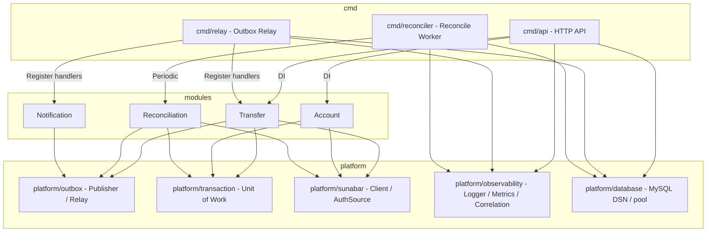
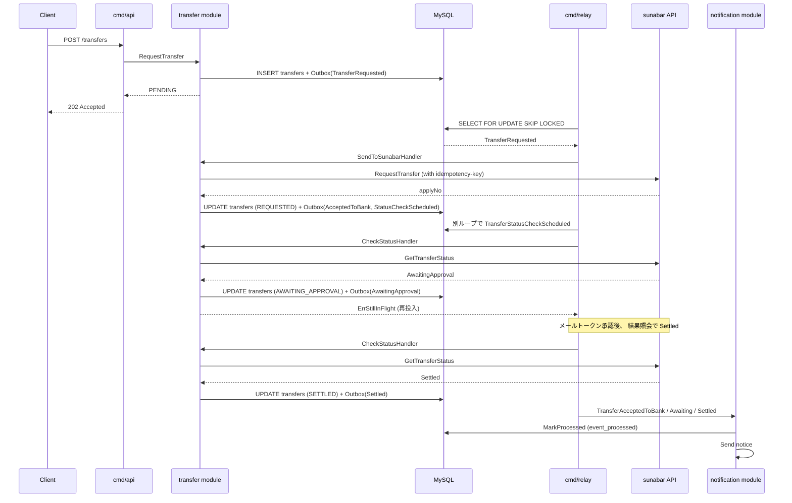

# アーキテクチャ図

go-sunabar-payments は 4 モジュールのモジュラーモノリスです。 各モジュールは port.go で定義した Service interface だけを公開し、 内部実装には他モジュールから直接依存しません。 横断的関心事 ( Outbox / トランザクション / sunabar クライアント / 観測性 ) は `internal/platform/*` に集約しています。

## モジュール境界

## データフロー ( 振込依頼 -> 承認 -> 確定 )

