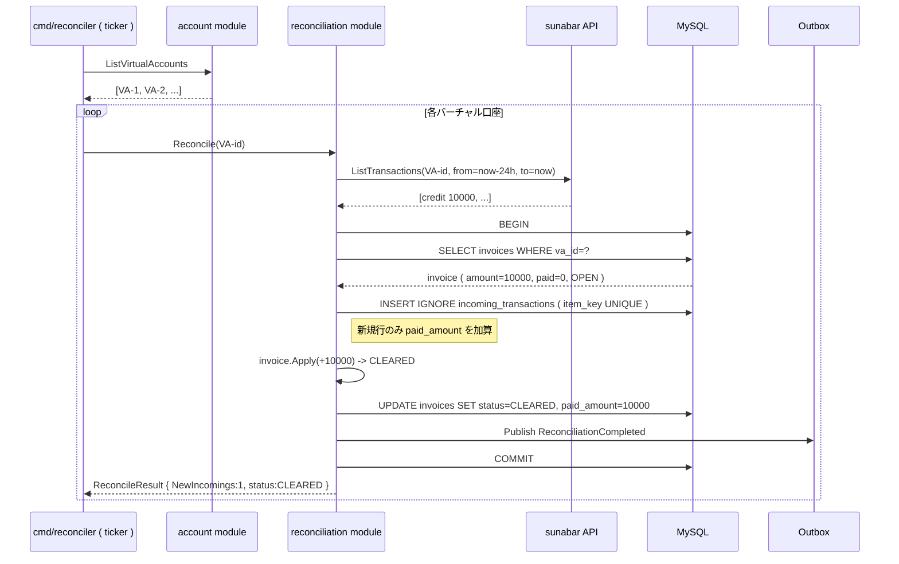

# 消込シーケンス

Reconciliation モジュールは バーチャル口座への入金を sunabar の入出金明細 API から取得し、 invoices テーブルと突合して status を進めます。 cmd/reconciler が定期的に呼び出します。

## マッチングロジック

| 入金合計と請求額の関係 | status |
| --- | --- |
| 入金 = 0 | OPEN ( 既定 ) |
| 0 < 入金 < 請求 | PARTIAL |
| 入金 = 請求 | CLEARED |
| 入金 > 請求 | EXCESS ( 過入金、 手動確認 ) |

## 重複防止

- `incoming_transactions` テーブルに `UNIQUE KEY (virtual_account_id, item_key)` を張り、 同じ入金行を 2 回登録しない
- `INSERT IGNORE` で重複時は黙ってスキップする
- 重複だった場合は invoice への加算もスキップする ( 二重消込防止 )
