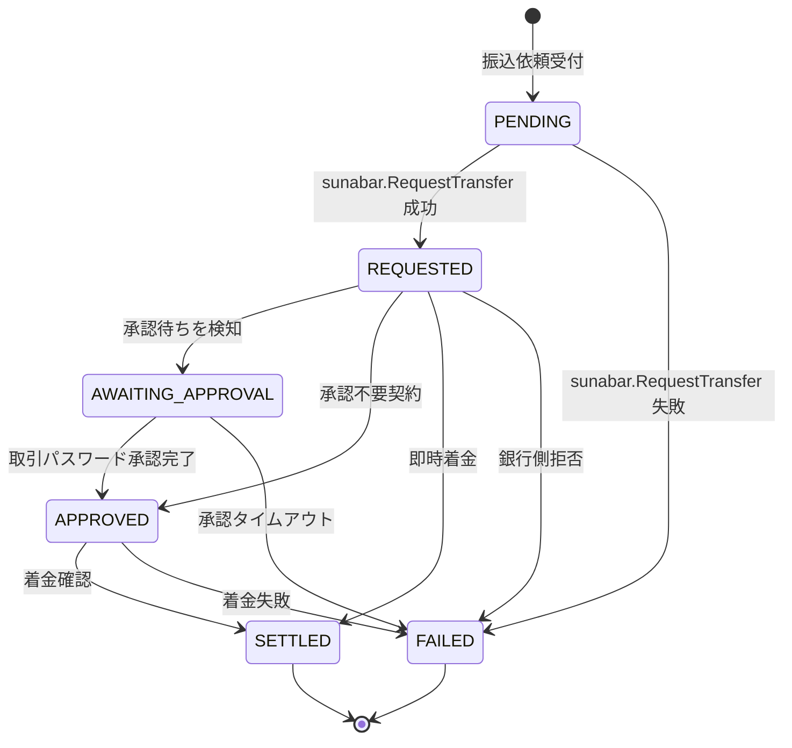

# Transfer の状態機械

`internal/modules/transfer/domain/status.go` の `validTransitions` をそのまま図にしたものです。 詳細は ADR-004 を参照してください。

## 各状態の意味

| Status | 意味 | 通知イベント |
| --- | --- | --- |
| PENDING | アプリで受付済み、 sunabar 未送信 | なし |
| REQUESTED | sunabar 受付済み、 結果未確定 | TransferAcceptedToBank |
| AWAITING_APPROVAL | メールトークン承認待ち | TransferAwaitingApproval |
| APPROVED | sunabar 側で承認済み、 着金処理中 | なし |
| SETTLED | 着金完了 ( 終端 ) | TransferSettled |
| FAILED | 失敗 ( 終端 ) | TransferFailed |
